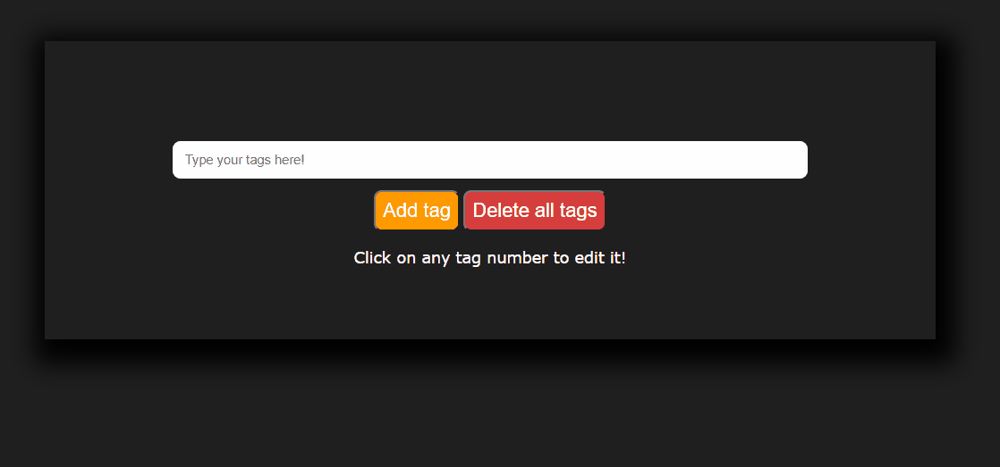

## AdCash assignment
Adcash test assignment for Software Engineering Intern - Front End.

## About the Project

### Concept of the project is to add positive or negative numeric values to the list.



#### Adding tags
* Users are able to insert a number to the input field.
* Tags with a positive value are colored red and tags with a negative value are colored blue.
* While refreshing the page, the tags will remain saved in the browser.

#### Saving tags
* Either by clicking on the "Add tag" button or by pressing Enter, ";" or "," after typing in a number, the string gets automatically added to the list.

#### Editing
* You can edit a tag by clicking on the number value inside the borders.
* Only one tag can be edited at a time.

#### Deleting
* By pressing the "X" inside the individual tag borders, you can delete the tag.
* By pressing the "Delete all tags" button, all the tags below will be deleted.

### Installation

1. Clone the repo:
   ```sh
   git clone https://github.com/kentmarcusp/AdCashAssignment
   ```
2. Install NPM packages:
   ```sh
   npm install
   ```
3. Install Node-SASS:
   ```sh
   npm install node-sass
   ```
4. Compile SCSS:
   ```sh
   npm run sass
   ```

## Built With

* HTML
* CSS (SASS as preprocessor)
* Vanilla JS
---


## Contact

Kent-Marcus Pluutus - Kent.marcus.p@gmail.com

Project Link: [https://github.com/kentmarcusp/AdCashAssignment](https://github.com/kentmarcusp/AdCashAssignment)

## Acknowledgements
* [Font Awesome](https://fontawesome.com)
